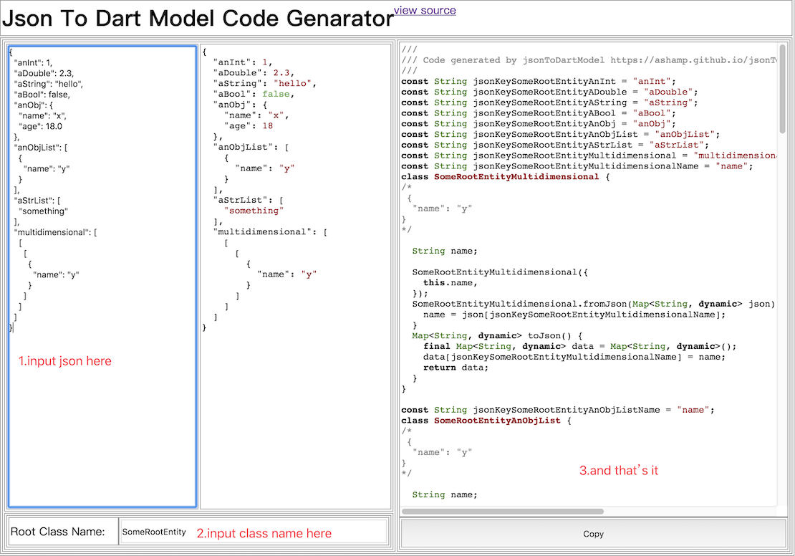

# jsonToDartModel

online tool for convert json to dart code

click [https://ashamp.github.io/jsonToDartModel/](https://ashamp.github.io/jsonToDartModel/)

## Feature
- online use, without plugin
- surport multidimensional list
- surport complex json
- single file
- dart keyword protected
- instant convert

## FYI
- ~~`int` type will converted to `double`~~
- object should have at least one property
- only first object in array will be parsed

## Usage
1. input json string in left textinput
2. input root class name in left bottom textinput
3. copy code by button or mouse

## Example
json string may looks like
``` json
{
  "anInt": 1,
  "aDouble": 2.3,
  "aString": "hello",
  "aBool": false,
  "anObj": {
    "name": "x",
    "age": 18.0
  }
}
```
named it `SomeRootEntity` and convert to dart
``` dart
  var obj = SomeRootEntity.fromJson(jsonDecode(json));
  String encodedJson = jsonEncode(obj.toJson());
  print(encodedJson);//{"anInt":1.0,"aDouble":2.3,"aString":"hello","aBool":false,"anObj":{"name":"x","age":18.0}}
```

